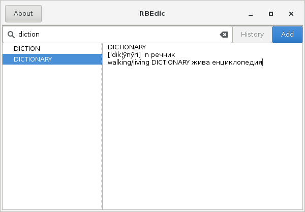
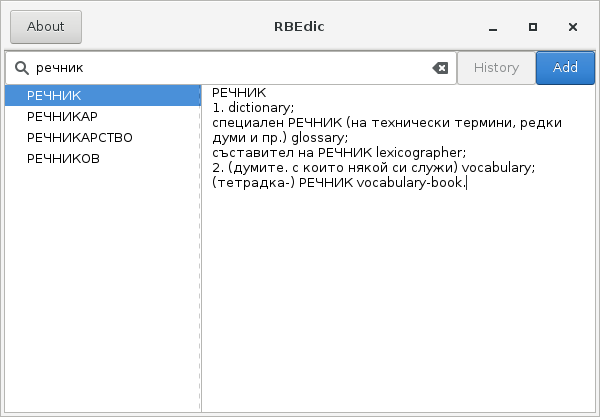

# RBEdic

RBEdic is Bulgarian-English two-way dictionary,
written in Rust with GTK and analogous
to [KBE Dictionary](http://kbedic.sourceforge.net).






## Download precompiled binary from releases

[rbedic Releases](https://github.com/idzhonev/rbedic/releases)

## Installation under Linux

### Building from source code
You need Rust toolchain installed: [https://www.rust-lang.org](https://www.rust-lang.org).
Successfully builds with `stable` and `nightly`.

Clone repository and start build:
```
$ git clone https://github.com/idzhonev/rbedic
$ cd rbedic
$ cargo build --release
```

* You can copy `target/release/rbedic` binary executable file
to folder `/usr/bin/` etc.

### Dictionary's database

Get archive from [bedic data Releases](https://github.com/idzhonev/bedic_data-utf8/releases)
or clone repository with database files:
```
$ git clone https://github.com/idzhonev/bedic_data-utf8
$ cd bedic_data-utf8
```

Execute these commands (with root privileges):
```
$ sudo mkdir -p /usr/local/share/bedic
$ sudo cp en_bg-utf8.dat /usr/local/share/bedic/
$ sudo cp bg_en-utf8.dat /usr/local/share/bedic/
```


## Running

* Because of Gtk-Warnings that slow down responsiveness, you can redirect
*stderr* to /dev/null
```
$ rbedic 2> /dev/null
```

* Recording history to file

By clicking the Add button or pressing CTRL+s, current word translation
will be send to *stdout*. So
you can configure execution like this:
```
$ rbedic >> ~/new_words.txt 2> /dev/null
```

* Can make `.bashrc` aliases like these:
```
$ echo "alias rbedic='/usr/bin/rbedic > /dev/null 2>&1'" >> ~/.bashrc
$ echo "alias hrbedic='/usr/bin/rbedic 2> /dev/null | tee -a ~/new_words.txt'" >> ~/.bashrc
$ source ~/.bashrc
```

* Enable logging (can use `info, debug, trace`)
```
$ RUST_LOG=trace target/release/rbedic
```


## License

1. RBEdic is licensed under either of the following, at your option:

 * Apache License, Version 2.0, ([LICENSE-APACHE](LICENSE-APACHE) or
[http://www.apache.org/licenses/LICENSE-2.0](http://www.apache.org/licenses/LICENSE-2.0))
 * MIT License ([LICENSE-MIT](LICENSE-MIT) or
[http://opensource.org/licenses/MIT](http://opensource.org/licenses/MIT))

2. The [database files](https://github.com/idzhonev/bedic_data-utf8) (**en_bg-utf8.dat** and **bg_en-utf8.dat**) are licensed
under GNU GPL Version 2 ([LICENSE-GPLv2](https://github.com/idzhonev/bedic_data-utf8/LICENSE-GPLv2)
or [https://www.gnu.org/licenses/old-licenses/gpl-2.0.en.html](https://www.gnu.org/licenses/old-licenses/gpl-2.0.en.html)).

* See [http://kbedic.sourceforge.net/questions.html](http://kbedic.sourceforge.net/questions.html) (in Bulgarian)
